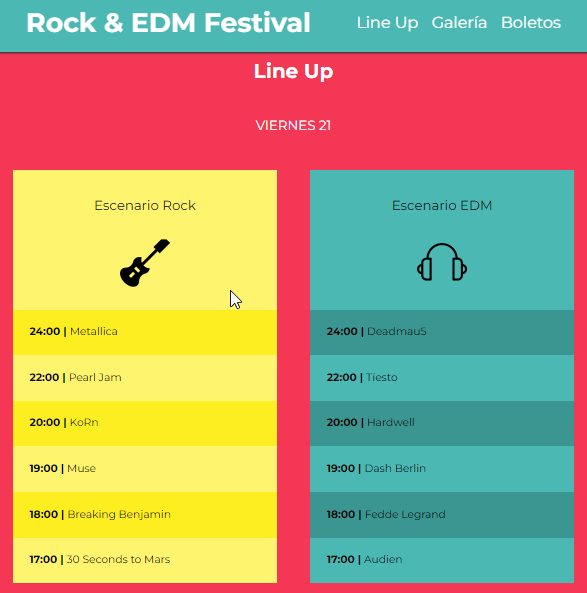
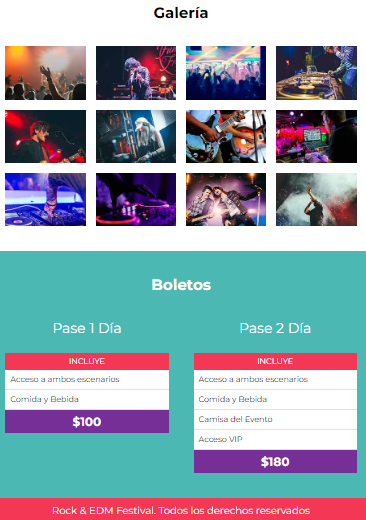

# Rock & EDM Festival

  

## Description

This is a single web which it pretend to be for a Festival of Music. In here, we present two days of music as Rock and EDM where it'll be bands like Metallica, Pearl Jam, Muse representanding rock music, and for EDM we'll have Deadmau5, Tiesto, Audien and others. That on Friday 21, on Saturday 22 we'll get The killers, Deftones, Lamb of god for Rock and Vini Vici, Ferry Corsten, Paul Van Dyk.

The site show you a little galery about the concert and the tickets for each day that you can get for the Festival, these can include differents things depending on the prices.

## Structure

The project has the basics things that you can find in a website, as can be a header that contains the logo, title, a nav and the date for the event.
After that, a section that contains a little explanation reffering to the festival, next we have a line up for the days with the hour and each band that will be in the event.

This section, the galery section and the tickets section were created with css grid for a better responsive.
this was a simple project where the main objective was understand how to use CSS Grid.

:blush: If you wanna watch this proyect you can do it <a href="https://randy-urriola.github.io/FestivalMusica/" target="blank">Here</a>

 

## 💻 Programming Lenguages and Tools used:

<code></code>&nbsp;&nbsp;
<code></code>&nbsp;&nbsp;
<code></code>&nbsp;&nbsp;
